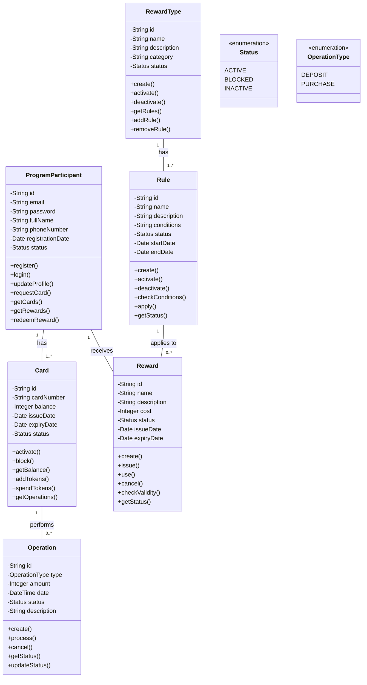

# Диаграмма классов

## Описание классов

### ProgramParticipant (Участник программы)
Класс, представляющий участника программы лояльности. Содержит информацию о пользователе и методы для управления его данными.

### Card (Карта)
Класс, представляющий карту лояльности. Содержит информацию о балансе и методы для работы с картой.

### Operation (Операция)
Класс, представляющий операции с картой (пополнение, покупка). Содержит информацию о типе и сумме операции.

### Reward (Вознаграждение)
Класс, представляющий вознаграждение. Содержит информацию о стоимости и статусе вознаграждения.

### Rule (Правило)
Класс, представляющий правило начисления вознаграждений. Содержит условия применения правила.

### RewardType (Вид вознаграждения)
Класс, представляющий вид вознаграждения. Содержит информацию о категории вознаграждения.

### Status (Статус)
Перечисление, определяющее возможные статусы объектов системы.

### OperationType (Тип операции)
Перечисление, определяющее возможные типы операций с картой. 