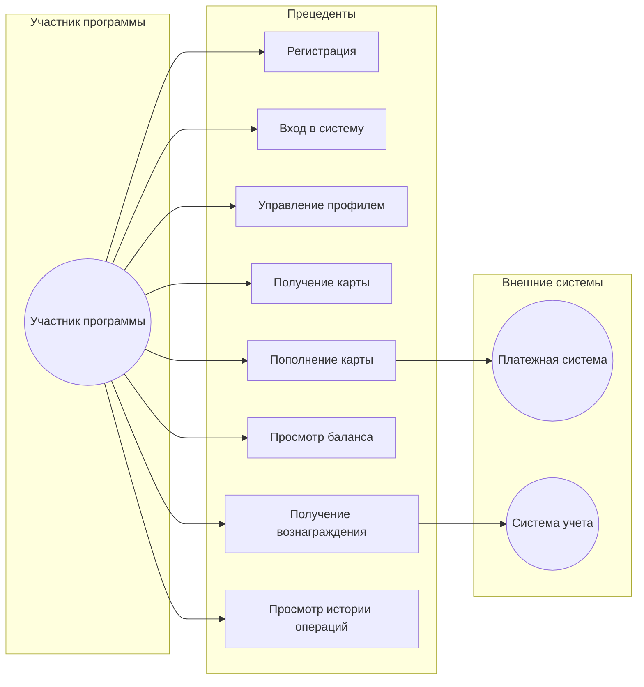

# Диаграмма прецедентов

## Описание прецедентов

### Регистрация
- **Актор**: Участник программы
- **Предусловия**: Отсутствуют
- **Основной поток**:
  1. Участник заполняет форму регистрации
  2. Система проверяет данные
  3. Система создает учетную запись
  4. Система отправляет подтверждение
- **Постусловия**: Создана учетная запись участника

### Вход в систему
- **Актор**: Участник программы
- **Предусловия**: Участник зарегистрирован
- **Основной поток**:
  1. Участник вводит учетные данные
  2. Система проверяет данные
  3. Система предоставляет доступ
- **Постусловия**: Участник авторизован

### Управление профилем
- **Актор**: Участник программы
- **Предусловия**: Участник авторизован
- **Основной поток**:
  1. Участник просматривает профиль
  2. Участник изменяет данные
  3. Система сохраняет изменения
- **Постусловия**: Профиль обновлен

### Получение карты
- **Актор**: Участник программы
- **Предусловия**: Участник авторизован
- **Основной поток**:
  1. Участник запрашивает карту
  2. Система создает карту
  3. Система отправляет уведомление
- **Постусловия**: Создана карта лояльности

### Пополнение карты
- **Актор**: Участник программы
- **Предусловия**: У участника есть карта
- **Основной поток**:
  1. Участник выбирает сумму
  2. Система обрабатывает платеж
  3. Система обновляет баланс
- **Постусловия**: Баланс карты пополнен

### Просмотр баланса
- **Актор**: Участник программы
- **Предусловия**: У участника есть карта
- **Основной поток**:
  1. Участник запрашивает баланс
  2. Система отображает информацию
- **Постусловия**: Отображен текущий баланс

### Получение вознаграждения
- **Актор**: Участник программы
- **Предусловия**: Достаточно фишек на карте
- **Основной поток**:
  1. Участник выбирает вознаграждение
  2. Система проверяет баланс
  3. Система списывает фишки
  4. Система выдает вознаграждение
- **Постусловия**: Вознаграждение получено

### Просмотр истории операций
- **Актор**: Участник программы
- **Предусловия**: У участника есть карта
- **Основной поток**:
  1. Участник запрашивает историю
  2. Система отображает операции
- **Постусловия**: Отображена история операций 