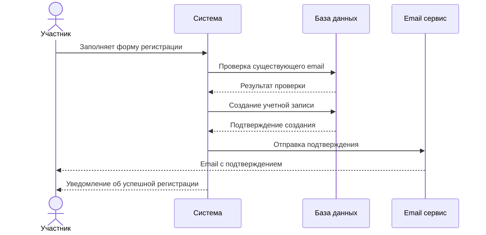
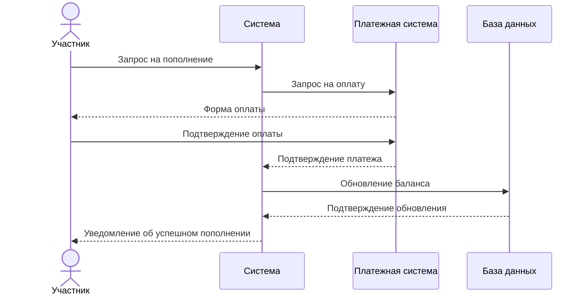
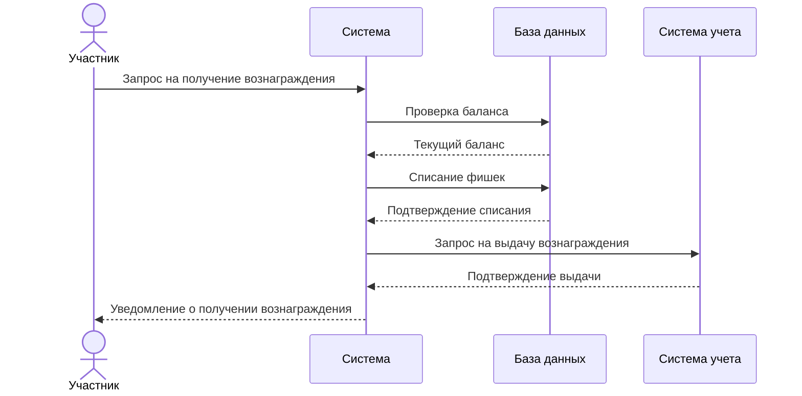

# Диаграммы последовательности

## Регистрация участника

## Пополнение карты

## Получение вознаграждения

## Описание диаграмм

### Регистрация участника
Диаграмма показывает процесс регистрации нового участника программы лояльности, включая проверку данных, создание учетной записи и отправку подтверждения.

### Пополнение карты
Диаграмма иллюстрирует процесс пополнения баланса карты лояльности, включая взаимодействие с платежной системой и обновление данных.

### Получение вознаграждения
Диаграмма демонстрирует процесс получения вознаграждения участником программы, включая проверку баланса, списание фишек и выдачу вознаграждения. 