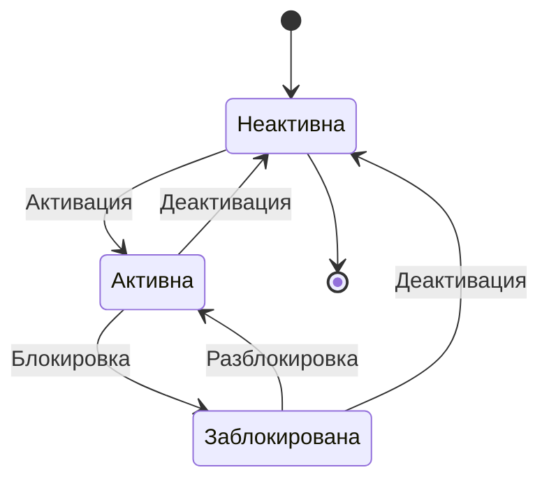
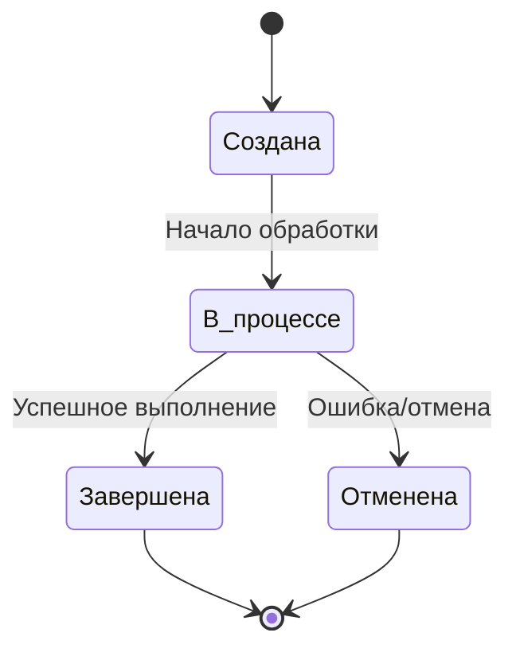
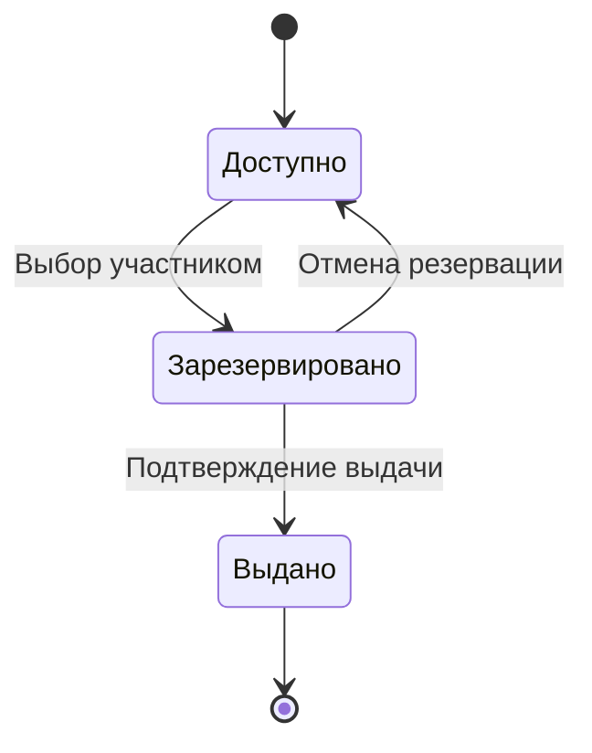

# Диаграммы состояний

## Состояние карты лояльности

## Состояние операции

## Состояние вознаграждения

## Описание диаграмм

### Состояние карты лояльности
Диаграмма показывает возможные состояния карты лояльности и переходы между ними:
- Неактивна: начальное состояние новой карты
- Активна: карта готова к использованию
- Заблокирована: карта временно недоступна

### Состояние операции
Диаграмма иллюстрирует жизненный цикл операции с картой:
- Создана: операция зарегистрирована
- В процессе: операция обрабатывается
- Завершена: операция успешно выполнена
- Отменена: операция отменена или завершилась с ошибкой

### Состояние вознаграждения
Диаграмма демонстрирует возможные состояния вознаграждения:
- Доступно: вознаграждение доступно для получения
- Зарезервировано: вознаграждение выбрано участником
- Выдано: вознаграждение получено участником 