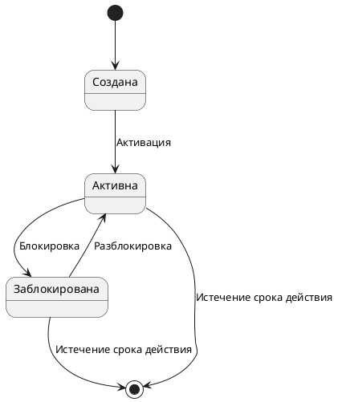
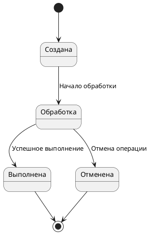
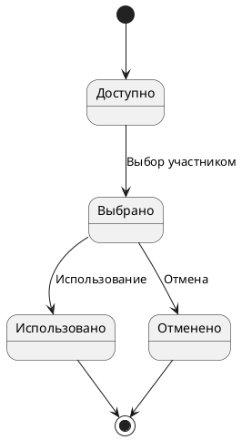
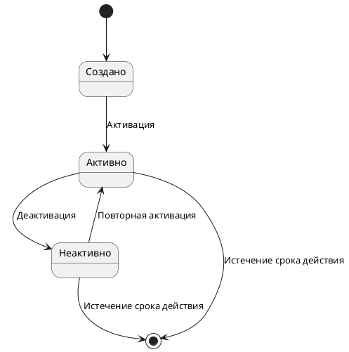

# Диаграммы состояний

## 1. Состояния карты лояльности

```plantuml
@startuml
[*] --> Создана
Создана --> Активна : Активация
Активна --> Заблокирована : Блокировка
Заблокирована --> Активна : Разблокировка
Активна --> [*] : Истечение срока действия
Заблокирована --> [*] : Истечение срока действия
@enduml
```

## 2. Состояния операции

```plantuml
@startuml
[*] --> Создана
Создана --> Обработка : Начало обработки
Обработка --> Выполнена : Успешное выполнение
Обработка --> Отменена : Отмена операции
Выполнена --> [*]
Отменена --> [*]
@enduml
```

## 3. Состояния вознаграждения

```plantuml
@startuml
[*] --> Доступно
Доступно --> Выбрано : Выбор участником
Выбрано --> Использовано : Использование
Выбрано --> Отменено : Отмена
Использовано --> [*]
Отменено --> [*]
@enduml
```

## 4. Состояния правила

```plantuml
@startuml
[*] --> Создано
Создано --> Активно : Активация
Активно --> Неактивно : Деактивация
Неактивно --> Активно : Повторная активация
Активно --> [*] : Истечение срока действия
Неактивно --> [*] : Истечение срока действия
@enduml
``` 