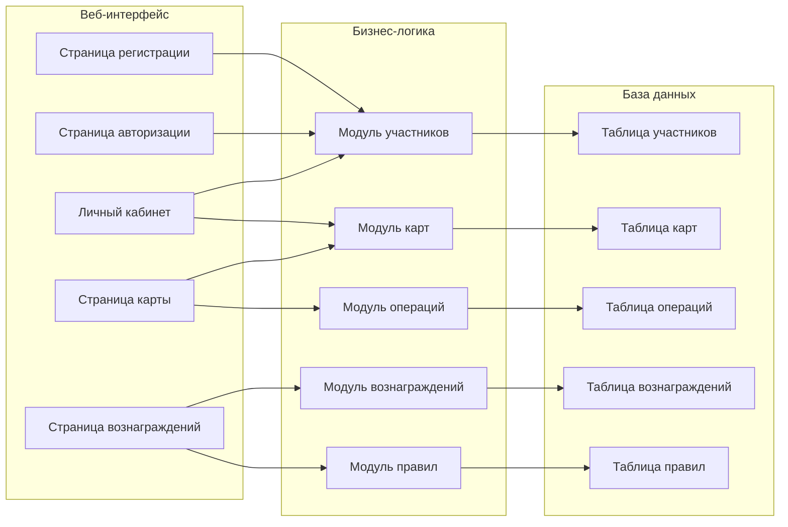

# Диаграмма компонентов

## Описание компонентов

### Веб-интерфейс
- **Страница регистрации**: Форма для регистрации новых участников программы
- **Страница авторизации**: Форма для входа в систему
- **Личный кабинет**: Основная страница участника программы
- **Страница карты**: Управление картой лояльности
- **Страница вознаграждений**: Просмотр и получение вознаграждений

### Бизнес-логика
- **Модуль участников**: Управление данными участников программы
- **Модуль карт**: Управление картами лояльности
- **Модуль операций**: Обработка операций с картами
- **Модуль вознаграждений**: Управление вознаграждениями
- **Модуль правил**: Управление правилами начисления вознаграждений

### База данных
- **Таблица участников**: Хранение данных участников программы
- **Таблица карт**: Хранение данных карт лояльности
- **Таблица операций**: Хранение истории операций
- **Таблица вознаграждений**: Хранение данных вознаграждений
- **Таблица правил**: Хранение правил начисления вознаграждений 