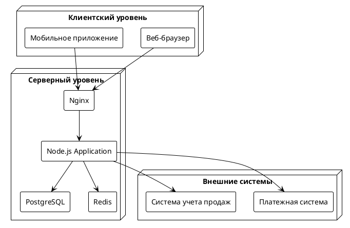

# Диаграмма развертывания

## Описание
Диаграмма развертывания показывает физическую архитектуру системы программы лояльности "Астрокофе", включая узлы, компоненты и их взаимосвязи.

## Диаграмма

## Компоненты системы

### Клиентский уровень
- **Веб-браузер**: Доступ к веб-интерфейсу системы
- **Мобильное приложение**: Доступ к системе через мобильное приложение

### Серверный уровень
- **Nginx**: Веб-сервер и балансировщик нагрузки
- **Node.js Application**: Основное приложение с бизнес-логикой
- **PostgreSQL**: Основная база данных
- **Redis**: Кэширование и хранение сессий

### Внешние системы
- **Платежная система**: Обработка платежей
- **Система учета продаж**: Интеграция с системой учета

## Требования к развертыванию

### Аппаратные требования
- **Сервер приложений**:
  - CPU: 4+ ядер
  - RAM: 8+ GB
  - HDD: 100+ GB SSD

- **Сервер базы данных**:
  - CPU: 4+ ядер
  - RAM: 16+ GB
  - HDD: 200+ GB SSD

### Программные требования
- **Node.js**: 14.x
- **PostgreSQL**: 13.x
- **Redis**: 6.x
- **Nginx**: 1.18+
- **Docker**: 20.x
- **Kubernetes**: 1.20+

## Процесс развертывания

### Подготовка окружения
1. Установка Docker и Kubernetes
2. Настройка кластера
3. Подготовка конфигурационных файлов

### Развертывание компонентов
1. Развертывание базы данных
2. Развертывание кэша
3. Развертывание приложения
4. Настройка веб-сервера

### Настройка мониторинга
1. Настройка логирования
2. Настройка метрик
3. Настройка алертов

## Масштабирование

### Горизонтальное масштабирование
- Репликация базы данных
- Балансировка нагрузки
- Кэширование

### Вертикальное масштабирование
- Увеличение ресурсов серверов
- Оптимизация запросов
- Настройка индексов 