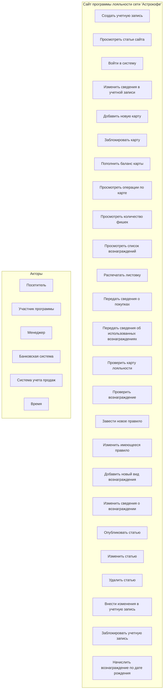
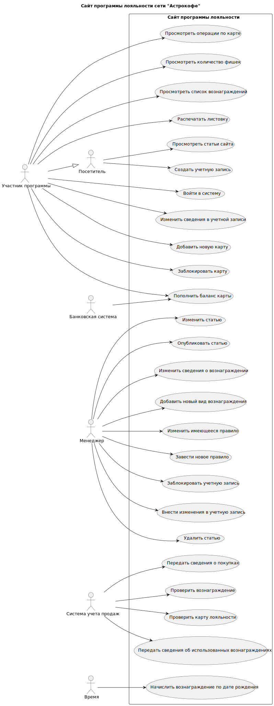

# Диаграмма вариантов использования

## Описание диаграммы

Диаграмма показывает все варианты использования системы и связи между ними и действующими лицами. Основные элементы:

1. **Границы системы** - показаны в виде прямоугольника, внутри которого находятся все варианты использования.

2. **Действующие лица**:
   - Посетитель
   - Участник программы (наследует возможности Посетителя)
   - Менеджер
   - Банковская система
   - Система учета продаж
   - Время

3. **Варианты использования** - показаны в виде овалов внутри границ системы.

4. **Связи** - показаны линиями между действующими лицами и вариантами использования.

5. **Наследование** - показано пунктирной линией между Участником программы и Посетителем, что означает, что Участник программы наследует все возможности Посетителя. 