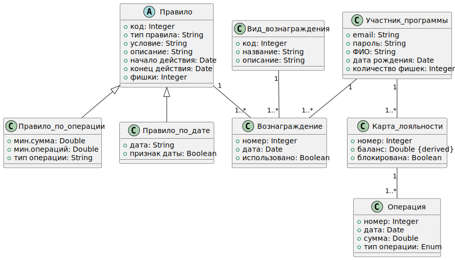

# Диаграмма классов



## Описание диаграммы

Диаграмма классов представляет собой визуальное представление структуры системы программы лояльности "Астрокофе". На диаграмме отображены все классы, их атрибуты, методы и связи между ними.

## Границы системы

Система включает в себя следующие основные компоненты:
1. Управление участниками программы
2. Управление картами лояльности
3. Управление операциями
4. Управление вознаграждениями
5. Управление правилами

## Классы и их атрибуты

### Участник программы
```
+ email: String
+ пароль: String
+ ФИО: String
+ дата рождения: Date
+ количество фишек: Integer
```

### Карта лояльности
```
+ номер: Integer
+ баланс: Double {derived}
+ блокирована: Boolean
```

### Операция
```
+ номер: Integer
+ дата: Date
+ сумма: Double
+ тип операции: Enum
```

### Вознаграждение
```
+ номер: Integer
+ дата: Date
+ использовано: Boolean
```

### Правило (абстрактный)
```
+ код: Integer
+ тип правила: String
+ условие: String
+ описание: String
+ начало действия: Date
+ конец действия: Date
+ фишки: Integer
```

### Правило по операции
```
+ мин.сумма: Double
+ мин.операций: Double
+ тип операции: String
```

### Правило по дате
```
+ дата: String
+ признак даты: Boolean
```

### Вид вознаграждения
```
+ код: Integer
+ название: String
+ описание: String
```

## Связи между классами

1. Участник программы (1) --- (1..*) Карта лояльности
2. Карта лояльности (1) --- (1..*) Операция
3. Участник программы (1) --- (1..*) Вознаграждение
4. Правило (1) --- (1..*) Вознаграждение
5. Вид вознаграждения (1) --- (1..*) Вознаграждение
6. Правило <|-- Правило по операции
7. Правило <|-- Правило по дате

## Ограничения

### Ограничения атрибутов
1. ФИО не должно быть пустым
2. Участник программы должен быть совершеннолетним на момент регистрации
3. Электронный адрес должен быть корректным
4. Пароль должен иметь не менее 6 символов
5. Конечная дата периода действия правила должна превышать начальную дату

### Ограничения связей
1. Карта лояльности не может существовать без участника программы
2. Операция не может существовать без карты лояльности
3. Вознаграждение не может существовать без участника программы
4. Вознаграждение не может существовать без правила
5. Вознаграждение не может существовать без вида вознаграждения
6. Правило по операции и Правило по дате не могут существовать без абстрактного класса Правило
